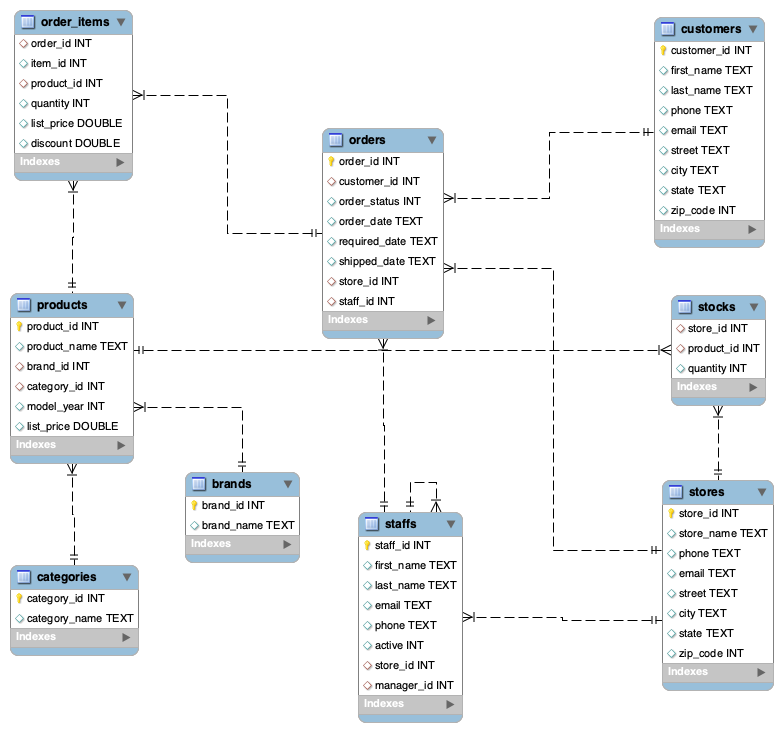

# 📊 Bikestore Data Analysis Project (Kaggle)

This project analyzes a bike store's sales, stock, and personnel performance using **SQL** and **Python**.
Bu proje, bir bisiklet mağazasının satış, stok ve personel performansını **SQL** ve **Python** kullanarak analiz eder.

---

## 🌍 Language / Dil Seçimi

<b>🇺🇸 Click for English</b>

### 🛠️ Technologies Used
* **SQL:** Data extraction and business questions.
* **Python:** Data cleaning and visualization (Pandas, Seaborn).
* **Database:** MySQL / SQLite.

### 🔍 Key Insights
1. **Brand Turnover:** Total revenue per brand.
2. **Stock Alerts:** Products with stock < 5.
3. **Staff Performance:** Ranking by total orders.

### 📊 Database Schema

<b>🇹🇷 Türkçe için Tıklayın</b>

### 🛠️ Kullanılan Teknolojiler
* **SQL:** Veri çekme ve iş soruları analizi.
* **Python:** Veri temizleme ve görselleştirme (Pandas, Seaborn).
* **Veritabanı:** MySQL / SQLite.

### 🔍 Temel Bulgular
1. **Marka Cirosu:** Marka başına toplam gelir.
2. **Stok Uyarıları:** Stoğu 5'ten az olan ürünler.
3. **Personel Performansı:** Toplam siparişe göre sıralama.

### 📊 Veritabanı Şeması

---

## 🚀 Future Steps / Gelecek Adımlar
- [ ] Detailed data visualization with **Seaborn**.
- [ ] Customer segmentation analysis.
- [ ] EDA (Exploratory Data Analysis) with Python.
